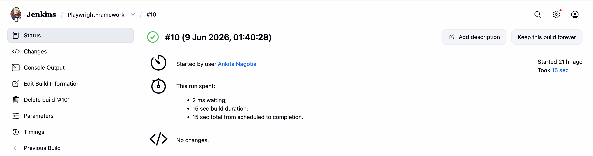
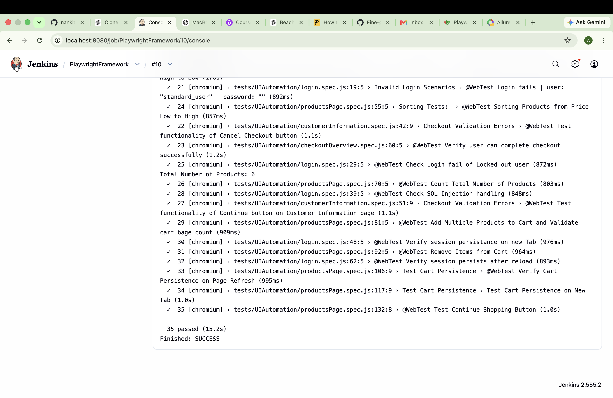
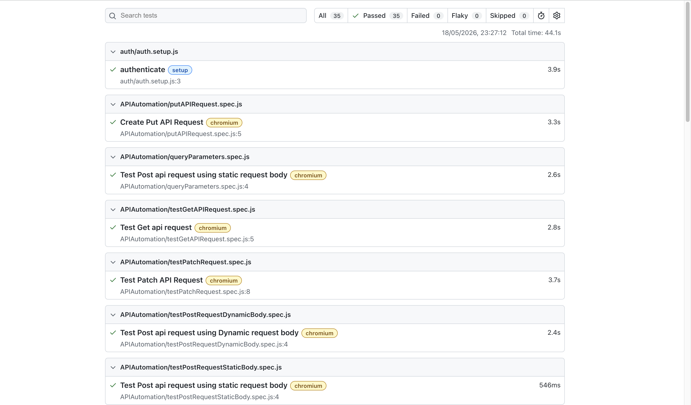
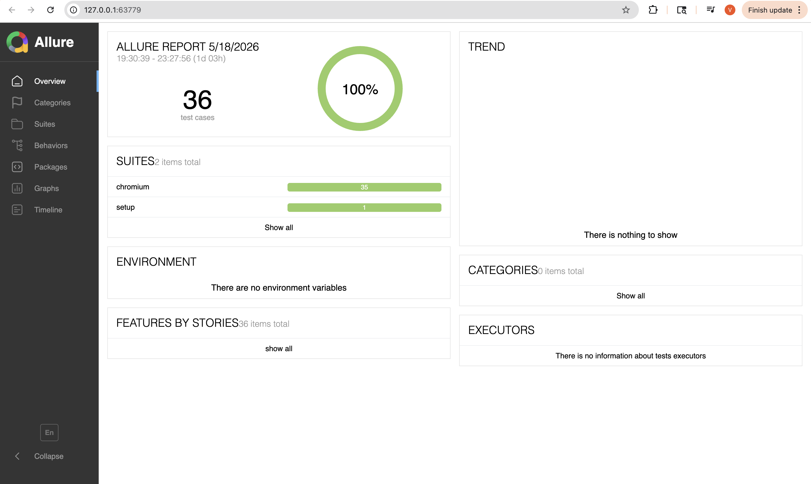

# 🚀 Playwright API + UI Automation Framework

A scalable automation framework built using Playwright and JavaScript for UI and API testing. The framework follows modern automation engineering practices with reusable architecture, authentication state management, cross-browser execution, CI/CD integration, and rich reporting.

---

## 📌 Key Features

### UI Automation

* End-to-End Testing
* Cross-Browser Testing
* Parallel Execution
* Authentication State Reuse
* Page Object Model (POM)

### API Automation

* GET Validation
* POST Validation
* PUT Validation
* PATCH Validation
* Request Validation
* Response Validation
* API Workflow Testing

### Reporting & Debugging

* Playwright HTML Reports
* Allure Reports
* Screenshots on Failure
* Trace Collection
* Video Recording on Failure

### CI/CD

* Jenkins Integration
* Automated Execution
* Build Monitoring

---

# 📈 Framework Statistics

| Metric | Details |
|----------|----------|
| Test Types | UI + API Automation |
| Architecture | Page Object Model + Fixtures |
| CI/CD | Jenkins |
| Reporting | Playwright HTML + Allure |
| Execution Strategy | Parallel Test Execution |
| Browser Coverage | Chromium, WebKit |
| Authentication | State Reuse |
| Debugging | Traces, Screenshots, Videos |

---

## 🛠 Tech Stack

| Technology     | Purpose               |
| -------------- | --------------------- |
| Playwright     | UI & API Automation   |
| JavaScript     | Framework Development |
| Node.js        | Runtime Environment   |
| Jenkins        | CI/CD                 |
| Allure         | Reporting             |

---

## 📂 Framework Structure

```bash
Playwright-API-UI-Framework
│
│
├── assets/screenshots
│   ├── allure-report.png
│   ├── jenkins-success.png
│   ├── playwright-report.png
│   └── test-execution.png
│
├── fixtures
│   └── pages.fixture.js
│
├── pages
│   ├── loginPage.js
│   ├── productsPage.js
│   ├── customerInformationPage.js
│   ├── checkoutOverviewPage.js
│   └── yourCartPage.js
│
├── test-data
│
├── tests
│   ├── UIAutomation
│   ├── APIAutomation
│   └── auth
│
├── utils
│   ├── randomDataGenerator.js
│   └── priceUtils.js
│
├── playwright.chromium.config.js
├── playwright.webkit.config.js
├── playwright.service.config.js
├── package.json
└── README.md
```

---

# 🏗 Framework Design

## Page Object Model (POM)

Centralized page actions improve maintainability and reduce code duplication.

## Fixtures

Reusable setup layers keep tests clean and scalable.

## Authentication State Management

Authentication is executed once and reused across tests to reduce execution time.

## Utility Layer

Reusable business logic is centralized in utility files.

---

# ⚡ Test Execution Commands

## Install Dependencies

```bash
npm install
```

## Run Full Regression Suite

```bash
npm run regression
```

## Run UI Tests

```bash
npm run webTest
```

## Run API Tests

```bash
npm run apiTest
```

## Run Chromium Tests

```bash
npm run chromiumTest
```

## Run Safari / WebKit Tests

```bash
npm run safariTest
```

## Generate Allure Report

```bash
npm run allureGenerate
```

## Open Allure Report

```bash
npm run allureOpen
```


---

## CI/CD Pipeline

### Jenkins Build Success



Jenkins pipeline is configured to:

- Pull latest code from GitHub
- Install project dependencies
- Execute Playwright test suites
- Generate Allure reports
- Publish execution results
- Provide fast feedback to the team

### Jenkins Test Execution



Parameterized Jenkins jobs allow selective execution of:

- Full Regression Suite
- UI Automation Tests
- API Automation Tests
- Browser-specific executions

Supported execution commands:

```bash
### Supported Jenkins Execution Commands

| Script | Description | Scope |
|---------|-------------|--------|
| `npm run regression` | Executes complete regression suite | UI + API |
| `npm run webTest` | Executes UI automation tests | UI |
| `npm run apiTest` | Executes API automation tests | API |
| `npm run chromiumTest` | Executes tests on Chromium browser | Chromium |
| `npm run safariTest` | Executes tests on WebKit/Safari browser | WebKit |
| `npm run allureGenerate` | Generates Allure report | Reporting |
| `npm run allureOpen` | Opens Allure report | Reporting |

```

---

# 📊 Reporting

## Playwright HTML Report

Provides detailed execution insights, passed/failed test information, execution duration, and debugging support.



---

## Allure Report

Provides advanced reporting with trends, execution history, detailed failure analysis, screenshots, and traces.



---

# 🎯 Framework Highlights

* UI + API Automation
* Page Object Model Architecture
* Fixture-Based Design
* Authentication State Reuse
* Parallel Execution
* Chromium Browser Support
* Safari/WebKit Browser Support
* Jenkins Integration
* Allure Reporting
* Playwright HTML Reporting
* Screenshot Capture
* Trace Collection
* Scalable Folder Structure

---

# 🔍 Problems Solved

* Reduces repetitive login execution
* Improves framework maintainability
* Supports reusable automation components
* Simplifies debugging and failure analysis
* Enables faster execution through parallel testing
* Supports CI/CD quality workflows
* Improves visibility through reporting


---

# 🔗 Repository

https://github.com/nankita245/Playwright-API-UI-Framework

---

⭐ If you find this framework useful, consider starring the repository.
