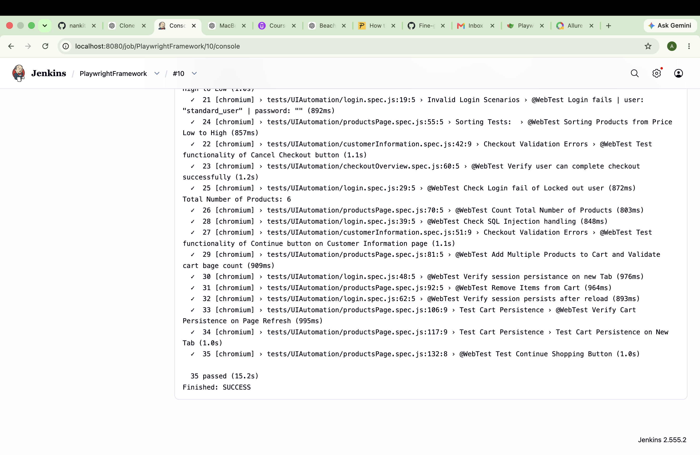

# 🚀 Playwright API + UI Automation Framework

A production-grade, scalable test automation framework built with **Playwright** and **JavaScript** — covering end-to-end UI flows, REST API validation, and CI/CD pipeline integration with rich reporting.

---
 
## 📌 What Is This Framework Testing?
 
This framework automates the **Sauce Demo e-commerce application** — a standard SDET benchmark app covering real-world user workflows including login, product browsing, cart management, and checkout. It demonstrates production-ready automation patterns applicable to any web + API stack.
 
**Automated Coverage:**
- 🔐 Authentication flows (valid/invalid login, session reuse)
- 🛒 Product listing, sorting, and selection
- 🛍️ Cart operations (add, remove, verify items)
- 💳 Full checkout workflow (customer info → order summary → confirmation)
- 🌐 REST API validation (GET / POST / PUT / PATCH endpoints)
- 🔄 End-to-end API workflow chaining
> **Test Suite Size:** 30+ automated test cases across UI and API layers
 
---

## 📌 Key Features
 
### ✅ UI Automation
- End-to-End Testing with real user flow simulation
- Cross-Browser Testing (Chromium + Safari/WebKit)
- Parallel Execution for faster feedback
- Authentication State Reuse via stored session files
- Page Object Model (POM) for clean, maintainable locators

### ✅ API Automation
- Full CRUD coverage: GET, POST, PUT, PATCH
- Request schema validation
- Response assertion (status codes, body, headers)
- Multi-step API workflow testing

### ✅ Reporting & Debugging
- Playwright HTML Reports with step-level detail
- Allure Reports with trend history and failure analysis
- Automatic screenshots on failure
- Trace Collection for root-cause debugging
- Video recording on test failure

### ✅ CI/CD
- GitHub Actions (on push / pull request triggers)
- Jenkins pipeline with scheduled + parameterized builds
- Automated regression execution and build monitoring

---
 
## 🛠 Tech Stack
 
| Technology     | Version  | Purpose                      |
| -------------- | -------- | -----------------------------|
| Playwright     | Latest   | UI & API Test Automation     |
| JavaScript     | ES2022+  | Framework Language           |
| Node.js        | 18+      | Runtime Environment          |
| GitHub Actions | Latest   | Cloud CI/CD                  |
| Jenkins        | LTS      | On-Premise CI/CD             |
| Allure         | 2.x      | Advanced HTML Reporting      |
 
---
## 📂 Framework Structure
 
```
Playwright-API-UI-Framework
│
├── .github/workflows
│   └── playwright.yml              # GitHub Actions CI pipeline
│
├── assets/screenshots              # Report and execution screenshots
│
├── fixtures
│   └── pages.fixture.js            # Custom fixture combining all page objects
│
├── pages                           # Page Object Model layer
│   ├── loginPage.js
│   ├── productsPage.js
│   ├── customerInformationPage.js
│   ├── checkoutOverviewPage.js
│   └── yourCartPage.js
│
├── test-data                       # Centralized test data (JSON/env files)
│
├── tests
│   ├── UIAutomation                # UI end-to-end test suites
│   ├── APIAutomation               # API validation test suites
│   └── auth                       # Login state setup (runs once, reused by all)
│
├── utils
│   ├── randomDataGenerator.js      # Dynamic test data generation
│   └── priceUtils.js               # Price calculation helpers
│
├── playwright.config.js            # Unified Playwright config (browsers, parallelism reporter)
├── package.json
└── README.md
```
 
---
## 🏗 Framework Design
 
### Page Object Model (POM)
 
Each page is encapsulated in its own class with locators and action methods — keeping tests free of raw selectors and reducing maintenance cost when the UI changes.
 
```javascript
// pages/loginPage.js
class LoginPage {
  constructor(page) {
    this.page = page;
    this.usernameInput = page.locator('[data-test="username"]');
    this.passwordInput = page.locator('[data-test="password"]');
    this.loginButton   = page.locator('[data-test="login-button"]');
    this.errorMessage  = page.locator('[data-test="error"]');
  }
 
  async login(username, password) {
    await this.usernameInput.fill(username);
    await this.passwordInput.fill(password);
    await this.loginButton.click();
  }
 
  async getErrorMessage() {
    return this.errorMessage.textContent();
  }
}
 
module.exports = { LoginPage };
```
 
---
 
### Fixture-Based Setup
 
Custom fixtures wire all page objects together, injecting them into any test that needs them. Tests stay declarative and clean.
 
```javascript
// fixtures/pages.fixture.js
const { test: base } = require('@playwright/test');
const { LoginPage }  = require('../pages/loginPage');
const { ProductsPage } = require('../pages/productsPage');
 
const test = base.extend({
  loginPage: async ({ page }, use) => {
    await use(new LoginPage(page));
  },
  productsPage: async ({ page }, use) => {
    await use(new ProductsPage(page));
  },
});
 
module.exports = { test };
```
 
---
 
### Authentication State Reuse
 
Login runs **once** during setup and the session cookie is saved to disk. All subsequent tests load the saved state instead of re-authenticating — reducing execution overhead by ~20% on large suites.
 
```javascript
// tests/auth/auth.setup.js
const { test: setup } = require('@playwright/test');
 
setup('authenticate', async ({ page }) => {
  await page.goto('/');
  await page.fill('[data-test="username"]', process.env.TEST_USER);
  await page.fill('[data-test="password"]', process.env.TEST_PASS);
  await page.click('[data-test="login-button"]');
  await page.waitForURL('**/inventory.html');
 
  // Save session to disk — reused by all UI tests
  await page.context().storageState({ path: 'playwright/.auth/user.json' });
});
```
 
```javascript
// playwright.config.js (snippet)
use: {
  storageState: 'playwright/.auth/user.json', // ← loaded by every test automatically
},
```
 
---
 
### API Test Example
 
API tests are written using Playwright's built-in `request` context — no extra HTTP library needed.
 
```javascript
// tests/APIAutomation/users.spec.js
const { test, expect } = require('@playwright/test');
 
test('POST /users — should create a new user', async ({ request }) => {
  const response = await request.post('https://reqres.in/api/users', {
    data: { name: 'Jane Doe', job: 'SDET' }
  });
 
  expect(response.status()).toBe(201);
 
  const body = await response.json();
  expect(body).toHaveProperty('id');
  expect(body.name).toBe('Jane Doe');
  expect(body.job).toBe('SDET');
});
 
test('GET /users — should return paginated user list', async ({ request }) => {
  const response = await request.get('https://reqres.in/api/users?page=1');
 
  expect(response.status()).toBe(200);
  const body = await response.json();
  expect(body.data.length).toBeGreaterThan(0);
  expect(body).toHaveProperty('total');
});
```
 
---
 
### Utility Layer
 
Reusable helpers keep test logic clean and avoid magic values scattered across files.
 
```javascript
// utils/randomDataGenerator.js
const { faker } = require('@faker-js/faker');
 
const generateCheckoutData = () => ({
  firstName: faker.person.firstName(),
  lastName:  faker.person.lastName(),
  zipCode:   faker.location.zipCode(),
});
 
module.exports = { generateCheckoutData };
```
 
```javascript
// utils/priceUtils.js
const calculateExpectedTotal = (prices, taxRate = 0.08) => {
  const subtotal = prices.reduce((sum, p) => sum + p, 0);
  return parseFloat((subtotal + subtotal * taxRate).toFixed(2));
};
 
module.exports = { calculateExpectedTotal };
```
 
---
 
## ⚙️ Prerequisites & Setup
 
### Requirements
 
- **Node.js** v18 or higher
- **npm** v8 or higher

# 📈 Framework Statistics

| Metric | Details |
|----------|----------|
| Test Types | UI + API Automation |
| Architecture | Page Object Model + Fixtures |
| CI/CD | Jenkins |
| Reporting | Playwright HTML + Allure |
| Execution Strategy | Parallel Test Execution |
| Browser Coverage | Chromium, WebKit |
| Authentication | State Reuse |
| Debugging | Traces, Screenshots, Videos |


# ⚡ Test Execution Commands

## Install Dependencies

```bash
npm install
```

## Run Full Regression Suite

```bash
npm run regression
```

## Run UI Tests

```bash
npm run webTest
```

## Run API Tests

```bash
npm run apiTest
```

## Run Chromium Tests

```bash
npm run chromiumTest
```

## Run Safari / WebKit Tests

```bash
npm run safariTest
```

## Generate Allure Report

```bash
npm run allureGenerate
```

## Open Allure Report

```bash
npm run allureOpen
```
---
 
## 🧪 Test Execution
 
Playwright executes tests in parallel across workers to maximise speed. A typical full regression run completes in under **2 minutes**.
 

 
---

## CI/CD Pipeline

### Jenkins Build Success


Jenkins pipeline is configured to:

- Pull latest code from GitHub
- Install project dependencies
- Execute Playwright test suites
- Generate Allure reports
- Publish execution results
- Provide fast feedback to the team

### Jenkins Test Execution



Parameterized Jenkins jobs allow selective execution of:

- Full Regression Suite
- UI Automation Tests
- API Automation Tests
- Browser-specific executions

Supported execution commands:

### Supported Jenkins Execution Commands

| Script | Description | Scope |
|---------|-------------|--------|
| `npm run regression` | Executes complete regression suite | UI + API |
| `npm run webTest` | Executes UI automation tests | UI |
| `npm run apiTest` | Executes API automation tests | API |
| `npm run chromiumTest` | Executes tests on Chromium browser | Chromium |
| `npm run safariTest` | Executes tests on WebKit/Safari browser | WebKit |
| `npm run allureGenerate` | Generates Allure report | Reporting |
| `npm run allureOpen` | Opens Allure report | Reporting |


---

# 📊 Reporting

## Playwright HTML Report

Provides detailed execution insights, passed/failed test information, execution duration, and debugging support.


---

## Allure Report

Provides advanced reporting with trends, execution history, detailed failure analysis, screenshots, and traces.


---
 
## 🎯 Design Decisions & Why They Matter
 
| Decision | Reason |
|---|---|
| **POM Architecture** | Isolates locators from test logic — one change in the UI = one file to update |
| **Fixture injection** | Keeps test files focused on assertions, not setup boilerplate |
| **Auth state reuse** | Eliminates repeated login steps; speeds up large suites by ~20% |
| **Parallel execution** | Playwright workers cut total run time significantly vs sequential |
| **Dual CI/CD** | GitHub Actions for cloud PR validation; Jenkins for on-premise scheduled regression |
| **Allure + HTML reports** | HTML for quick dev feedback; Allure for trend tracking and post-sprint analysis |
 
---
## 🔍 Problems This Framework Solves
 
| Problem | Solution |
|---|---|
| Repetitive login in every test | Auth state saved once, reused everywhere |
| Fragile selectors scattered in tests | All locators centralized in Page Objects |
| Slow sequential test execution | Parallel workers via Playwright config |
| Debugging failures without context | Screenshots + traces + video captured automatically |
| No CI visibility | GitHub Actions + Jenkins integration with report artifacts |
| Inconsistent test data | Faker-powered dynamic data generators |
 
---

# 🎯 Framework Highlights

* UI + API Automation
* Page Object Model Architecture
* Fixture-Based Design
* Authentication State Reuse
* Parallel Execution
* Chromium Browser Support
* Safari/WebKit Browser Support
* Jenkins Integration
* Allure Reporting
* Playwright HTML Reporting
* Screenshot Capture
* Trace Collection
* Scalable Folder Structure

---

# 🔗 Repository

https://github.com/nankita245/Playwright-API-UI-Framework

---

⭐ If you find this framework useful, consider starring the repository.
